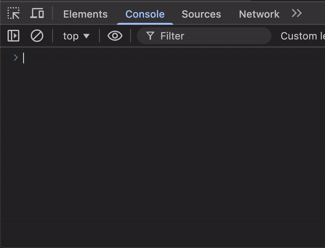

# modore



日本語版は [README.md](README.md)。

Modeless Japanese IME pickup. Type romaji into any app, hit the conversion
hotkey, and the word at the caret is replaced with its Mozc top-candidate
conversion.

## Status


| Host    | State                                                              |
| ------- | ------------------------------------------------------------------ |
| macOS   | shipping; configurable hotkey, candidate cycling + Esc-undo + optional candidate panel |
| Linux   | shipping; X11 grab + AT-SPI2 + Unix socket IPC + Wayland fallbacks |
| Windows | planned, not started                                               |


Per-host feature matrix: [docs/PARITY.md](docs/PARITY.md). Update it in the
same commit that adds or removes a capability.

## Build & run

```sh
make             # print the list of available targets
make build       # build the host app for the current platform
make run         # build and launch (Linux + macOS)
make open        # macOS only: build and open the .app bundle
```

First build pulls ~150 MB of Mozc + protobuf + abseil source and downloads
the ~48 MB Mozc OSS dictionary. Subsequent builds are incremental and finish
in a few seconds.

**macOS** prompts for Accessibility permission on first launch — required for
reading/writing the focused text field. Grant it in *System Settings → Privacy
& Security → Accessibility*, then re-launch. Once running, a **ﾓﾄﾞﾚ** label
appears in the menu bar; its menu shows the live hotkey + delivery path
(Carbon vs tap fallback) and has shortcuts for editing/revealing the config
and quitting. The label flips to red while another app holds Secure Keyboard
Entry (sudo prompts, password fields) — the OS blocks injection in that
state, so the menu surfaces which app to release.

**Linux** runs from your graphical login (AT-SPI needs the session D-Bus).
For Wayland compositors, Hyprland binds, the `--trigger` socket, Chromium/
Electron quirks, and the systemd user unit, see [docs/linux.md](docs/linux.md).

## Configuration

`~/.config/modore/modore.conf` (or `$XDG_CONFIG_HOME/modore/modore.conf`),
INI-style, only `[conversion]` is defined today:

```ini
[conversion]
hotkey = Ctrl+Shift+grave
```

Default is `Cmd+Semicolon` on macOS and `Super+Semicolon` on Linux. Full
hotkey grammar, modifier aliases, and key names in
[docs/configuration.md](docs/configuration.md).

## Layout

```
bridge/             Cross-platform C ABI around Mozc. CMake build.
engine/             Lua scripting (in development). Phase 01 complete; host API in Phase 02.
native/macos/       Swift host: event tap + Accessibility + clipboard fallback.
native/linux/       C++ host: X11 grab + Unix socket IPC + AT-SPI2 + clipboard fallback.
third_party/        fcitx5-mozc submodule (provides CMake build of Mozc engine).
```

The bridge is a shared library (`libmozc_bridge.dylib` on macOS,
`libmozc_bridge.so` on Linux, ~25 MB) that statically links the Mozc engine,
abseil, and protobuf. Frontends only need to consume the flat C ABI in
`bridge/include/mozc_bridge.h`.

## References

Implementation notes draw on:

- [espanso](https://github.com/espanso/espanso) — Carbon hotkey delivery,
synthetic-event marker, modifier-release wait, Unicode-injection chunking,
SecureInput watcher.
- [OpenKey](https://github.com/tuyenvm/OpenKey) — session-tap posting
location for synthetic key events (the path that reaches Chromium /
Electron).
- [ibus-hiragana](https://github.com/esrille/ibus-hiragana) — conversion-time
UX ideas (candidate cycling, MRU history, okurigana handling, per-conversion
katakana modifier).

## Requirements

- CMake 3.22+
- Python 3 (Mozc's build scripts invoke `python`)
- **macOS**: Xcode Command Line Tools
- **Linux**: GCC or Clang with C++20, X11 + XTest dev (`libX11`, `libXtst`),
AT-SPI (`atspi-2`, GLib), and `pkg-config`. Clipboard helpers: `xclip` (X11)
and/or `wl-clipboard` (`wl-paste` / `wl-copy`) on Wayland compositors.

## License

MIT, see [LICENSE](LICENSE). Bundled third-party code (Mozc, fcitx5-mozc,
abseil-cpp, protobuf) is BSD-3-Clause; see [bridge/NOTICE.md](bridge/NOTICE.md).